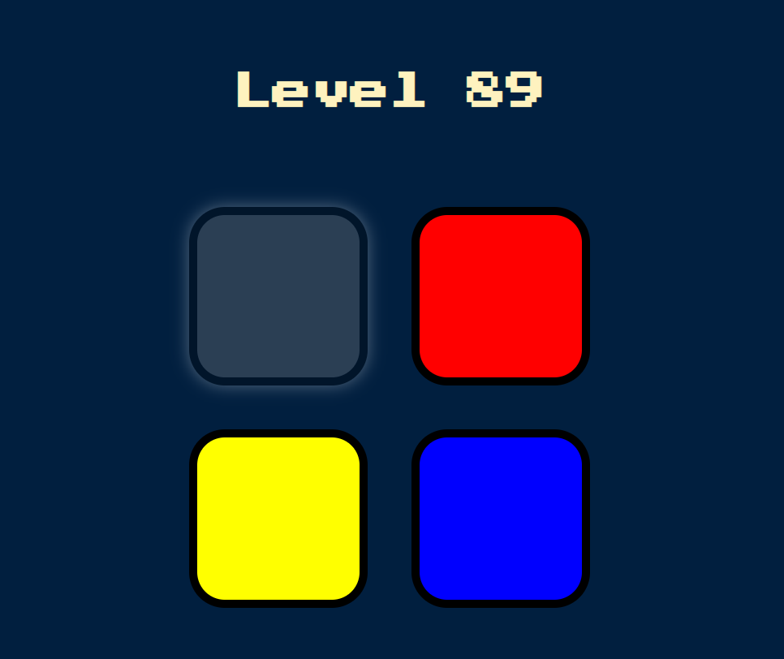
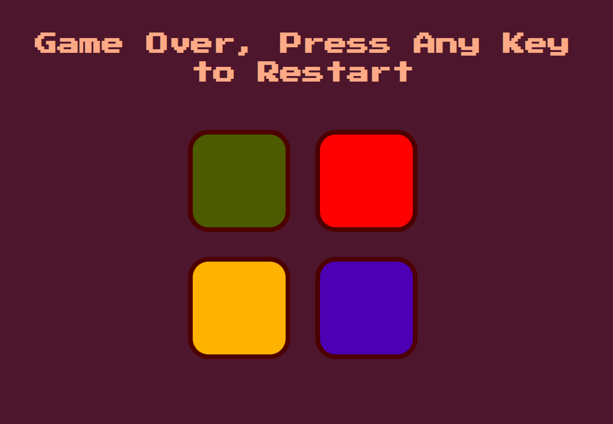

# Simon Game

## Table of contents

* [General info](#general-info)
* [Screenshots](#screenshots)
* [Technologies](#technologies)
* [Inspiration](#inspiration)

## _General info_

This is a browser version of a memory game where the script creates a series of tones and lights and requires a user to repeat the sequence. If you make a mistake at any point, you have to start over. At each level, you will be prompted with the last - new element of the sequence, but you have to remember the whole sequence and perform it each time. I used jQuery to simplify DOM manipulation.

## _Screenshots_

## _Technologies_
* jQuery - version 3.5.1

## _Inspiration_

 Project inspired by [Angela Yu](https://www.appbrewery.co)
